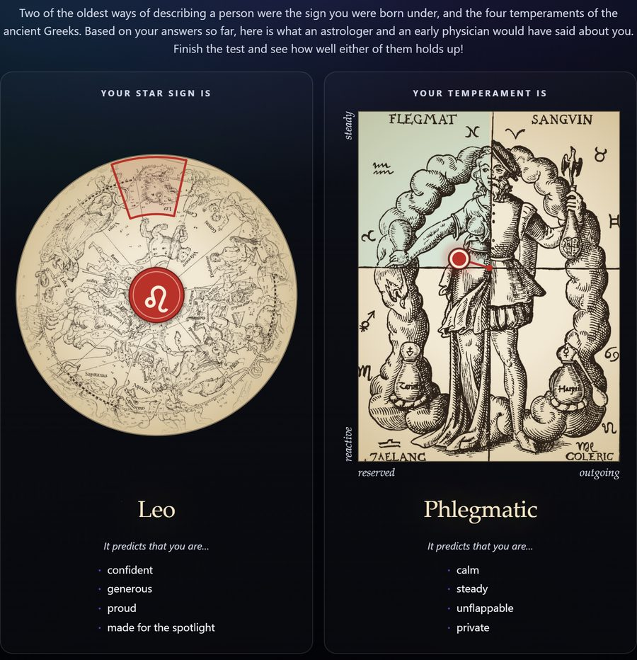
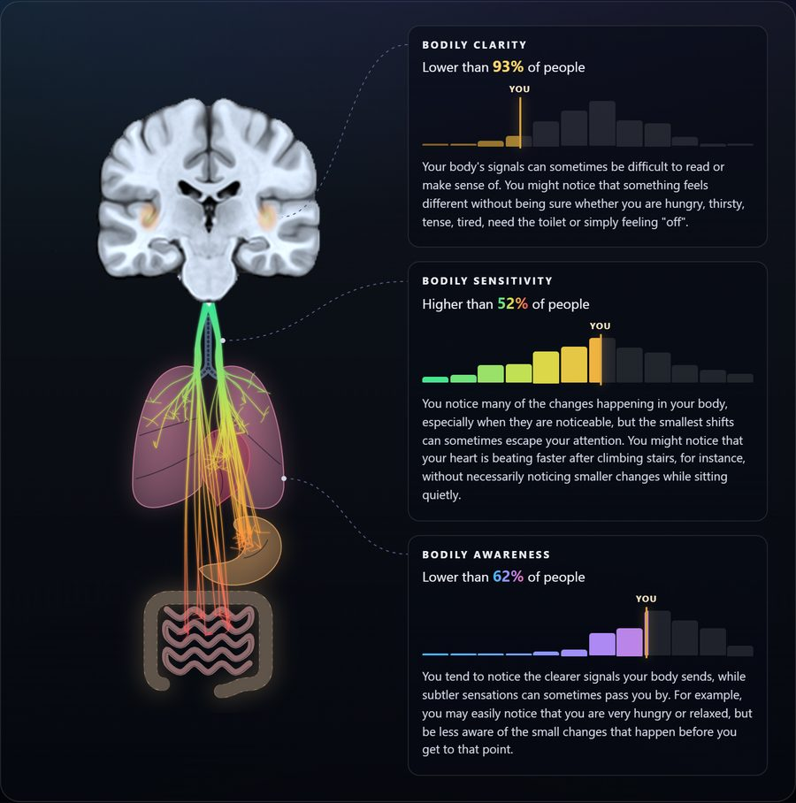
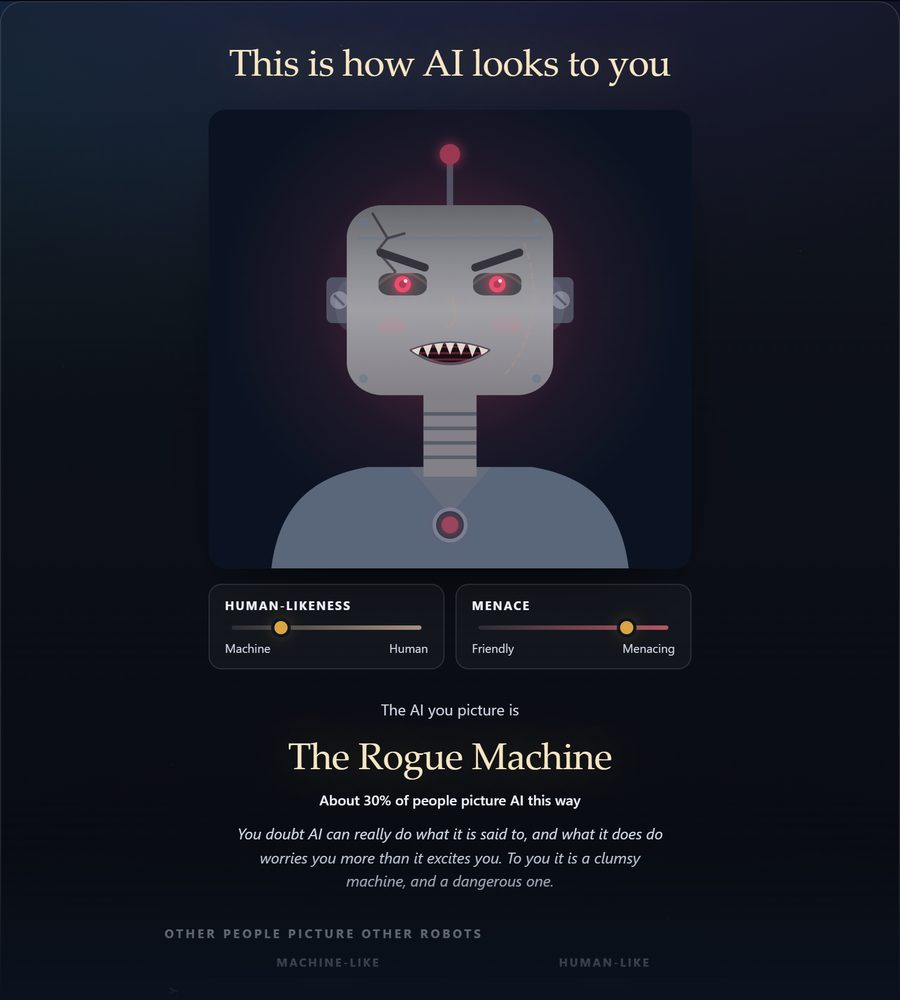

# The Abyss Test

The big dispositional characteristics survey.

- [**Documentation**](realitybendinglab.com/TestYourself/docs)

## Levels

Every level closes on results of its own. Each link below starts the test on that level, and the rest of the run follows.

<table>
  <tr>
    <td align="center" width="50%">
      <b>General</b> 
       
      <a href="https://realitybendinglab.com/TestYourself/?source=README"><b>Take the Star Sign Test!</b></a>
    </td>
    <td align="center" width="50%">
      <b>Brain-Body Axis</b> 
       
      <a href="https://realitybendinglab.com/TestYourself/?start=mint&amp;source=README"><b>Take the Body Awareness Test!</b></a>
    </td>
  </tr>
  <tr>
    <td align="center" width="50%">
      <b>AI Attitudes</b> 
       
      <a href="https://realitybendinglab.com/TestYourself/?start=bait&amp;source=README"><b>Take the AI Test!</b></a>
    </td>
    <td align="center" width="50%">
      <b>Mood &amp; Health</b> 
       
      <a href="https://realitybendinglab.com/TestYourself/?start=mood&amp;source=README"><b>Take the Wellbeing Test!</b></a>
    </td>
  </tr>
  <tr>
    <td align="center" width="50%">
      <b>Character</b> 
       
      <a href="https://realitybendinglab.com/TestYourself/?start=hexaco&amp;source=README"><b>Take the Personality Test!</b></a>
    </td>
    <td align="center" width="50%">
      <b>Archetypes</b> 
       
      <a href="https://realitybendinglab.com/TestYourself/?start=archetypes&amp;source=README"><b>Take the Archetype Test!</b></a>
    </td>
  </tr>
  <tr>
    <td align="center" width="50%">
      <b>The World</b> 
       
      <a href="https://realitybendinglab.com/TestYourself/?start=primals&amp;source=README"><b>Take the Worldview Test!</b></a>
    </td>
    <td align="center" width="50%">
      <b>How You Think</b> 
       
      <a href="https://realitybendinglab.com/TestYourself/?start=icar&amp;source=README"><b>Take the Thinking Style Test!</b></a>
    </td>
  </tr>
  <tr>
    <td align="center" width="50%">
      <b>Mind &amp; Heart</b> 
       
      <a href="https://realitybendinglab.com/TestYourself/?start=regulation&amp;source=README"><b>Take the Mind &amp; Heart Test!</b></a>
    </td>
    <td align="center" width="50%">
      <b>Where You Stand</b> 
       
      <a href="https://realitybendinglab.com/TestYourself/?start=opinions&amp;source=README"><b>Take the Political Test!</b></a>
    </td>
  </tr>
</table>

The pictures are drawn from stand-in scores, not anybody's answers, by `assets/readme/make.py`; rerun it when a figure changes.

**Sexuality.** Asked only by the `all` battery, since it is not yet covered by the ethics application. [Start on it](https://realitybendinglab.com/TestYourself/index.html?start=sex&battery=all&source=README).

**Your Hyborian Hero.** A short level on the philosophy of Robert E. Howard's world, closing on which of its heroes you would have been and which of its gods would have claimed you. Asked by no battery: a link naming it walks it first, ahead of the rest of the test. [Start on it](https://realitybendinglab.com/TestYourself/index.html?start=hyborian&source=README).

## Includes

What the test currently asks — every questionnaire, its reference and its
dimensions — is the **Content** slide of [the documentation deck](docs/index.html),
which is where that table now lives. Open `docs/index.html`; it needs nothing
installed. **Adding, removing or renaming anything in `content/` means updating
it in the same breath.**

## Options

Everything a link can say about a run goes after the address, e.g.
`https://realitybendinglab.com/TestYourself/?source=MyStudy&battery=test`. The participant is shown none of it.

| Option | What it does | Example |
|---|---|---|
| `?source=` | Where the link was handed out (a project, an experimenter, a page). Written into the saved file and its name, never shown. A link without one is saved as `Unknown`. | `?source=Prolific-Pilot` |
| `?sub=` | The participant's code, for a prewritten list or a platform's own id. Only `A-Z a-z 0-9 _ -` survive, 32 characters at most; otherwise a code is made up. | `?sub=P0042` |
| `?battery=` | Walk a named timeline out of `BATTERIES` in `content/timeline.js`. With none, or an unknown name, the run walks `all`: everything, the sexuality level included, with General first and every other level in one fork of three. `mint` is the test as the ethics application covers it, General, then the core (MINT, BAIT, HiTOP-BR), then the rest, and is asked only when named. Your Hyborian Hero is asked by neither, and is reached only by `?start=hyborian`. | `?battery=all` |
| `?only=` | Ask exactly these blocks (comma-separated), for testing. Applied over `battery`. | `?only=mint,icar` |
| `?skip=` | Ask everything but these blocks. Applied after `only`. | `?skip=opinions` |
| `?start=` | Bring the levels holding these blocks to the front, in the order named; the rest follow as usual. Moves whole levels, and brings a level the battery does not hold off the timeline that does. | `?start=icar` |
| `?test=true` | Test mode (or a bare `?test`): each questionnaire shrinks to one item, the rest are answered at random, and the consent gate opens unread. Still sends a real file, prefixed `test_`. | `?test=true&start=opinions` |
| `?card=1&s=` | Show somebody's whole-run profile web rather than the test. Made by the profile's "Copy share link", not by hand. | `?card=1&s=Curiosity~3.8,…` |
| `?card=1&level=&s=` | Show one level's results out of a shared link, with `m=` and `d=` (a birth month and a stand-in day) for level 1's star sign. Made by a level's "Copy link". | `?card=1&level=Character&s=…` |

Options combine with `&`. The blocks, in timeline order, are `fipi`, `singles` (General);
`mint` (Brain-Body Axis); `bait` (AI Attitudes); `mood`, `health`, `hitop`
(Mood & Health); `hexaco` (Character); `archetypes`; `primals` (The World); `icar` (How You Think); `regulation`
(Mind & Heart); `opinions` (Where You Stand); `sex` (Sexuality, asked only by `battery=all`); `hyborian` (Your Hyborian Hero, asked by no battery and reached only by `start=hyborian`); and `closing`, which is
always asked. `mood` and `hitop` are asked or
skipped together. `demographics1`, `demographics2` and `demographics3` belong to no level: they open the first three
levels, whatever those turn out to be, or the three after the levels `?start=` brings forward, which open on their own
questions; `?only=` and `?skip=` take them, `?start=` does not.

## Similar tests online

Worth going back to for what to add next and how to present it.

- **[TakeTest](https://taketest.xyz/)**: some forty free tests, most of them published instruments — the BFI-2, the IPIP-NEO-300, the Short Dark Triad, the ICAR-16 and ICAR-60, the MMPI-2 in full and short, the Autism-Spectrum Quotient, the Moral Foundations Questionnaire-2, right- and left-wing authoritarianism, conspiracy and paranormal belief scales, vocabulary and civics tests. Each is scored against a large normed sample (the UK Biobank, the General Social Survey), results collect in one place across tests, and signing in keeps them across devices. Ideas for tests, and for where real norms come from.
- **[Dimensional](https://www.dimensional.me/)** (an app): fifteen dimensions and "over 200 traits", from personality and values to love styles, attachment, attitudes to sexuality and political ideology, with profiles compared between friends and "compatibility" readings. No science claimed. Ideas for features: comparing with somebody else, and a reason to come back.
- **[Aella's surveys](https://aella.lol/)**: large self-run online surveys, some on far more extreme ground than anything here — the Big Kink Survey asks about zoophilia and incest, among much else — whose anonymised data from thousands of respondents have been made public, with respondents agreeing to it and no major harm reported. A precedent worth citing if the ethics reviewers push back on the sensitivity of our own items (diagnoses, political opinions) or on releasing the data openly: by comparison, what we ask is mild.

## Questionnaire Ideas

Not asked yet. "Partly there" names what the test already asks on the same ground.

| Domain | Idea | Notes | Partly there |
|---|---|---|---|
| Humour | Being funny, dark humour | | |
| Cognition | Wordsum | A short vocabulary test, heavily g-loaded ([thread](https://x.com/cremieuxrecueil/status/2098586478443901419?s=20)) | ICAR-16 (How You Think) |
| Cognition | Imagery across the senses | Short form of the PSIQ | |
| Cognition | Sensory sensitivity | Visual especially: it predicts everything | |
| Cognition | Obsessive-compulsive beliefs | Perfectionism, intolerance of uncertainty, control of thoughts | |
| Cognition | Cross-modal correspondences | | |
| Cognition | Abstract vs. concrete construal | | |
| Cognition | Rumination and worry | | CERQ's Rumination (Mind & Heart) |
| Cognition | Intolerance to Uncertainty | Would go in Beyond Madness (see Pop-Culture Hooks) |  |
| Unusual experiences | Paranormal beliefs | | |
| Unusual experiences | Unusual sensory experiences | | HiTOP-BR's Unusual Experiences (Mood & Health) |
| Unusual experiences | Fantasy proneness | | |
| Unusual experiences | Psychotic experiences | | HiTOP-BR's Unusual Experiences (Mood & Health) |
| Reality | Fake news and reality | A level of its own: see below | CMQ's Suspicion (Where You Stand), BAIT (AI Attitudes) |
| Identity | Masculine–feminine | | |
| Hormones | Menstrual cycle phase, contraceptive use, last sexual activity | For females. Needs a line saying why it is asked (conscious experience is shaped by hormonal state, which influences cognition and emotion) and a way to skip | |
| Sleep | Parasomnias and boundary failures | IOWA / MPS. **Ask Giulia about the validation of her scale** | |
| Sleep | Sleep health | SATED | SQS single (Mood & Health) |
| Sleep | Dreams | DIQ | |
| Sleep | Daytime sleepiness | ESS (Epworth) | |
| Family and work | Relationship status and satisfaction | | |
| Family and work | Dependents | | |
| Family and work | Occupation and job satisfaction | Would let `gjs` (in `content/block_UNUSED.js`) be asked, which waits on an employment item | |
| Sexuality | Sexual orientation | Kinsey scale? | |
| Sexuality | Sex-life satisfaction | The WHO scales cover many life domains, this among them, and are short | |
| Sexuality | Kinkiness | Aella's measures | |
| Self and others | Attachment style | | |
| Self and others | Empathy | | |
| Self and others | Peripersonal space | We made an avatar task for this a while back | |
| Self and others | Public and private self-consciousness | | |
| Self and others | Shame and disgust | | |
| Self and others | Social connection | | |
| Self and others | Suggestibility | SSS (Kotov et al., 2004), as in IllusionGameSuggestibility; see **Fake news and reality**, below | |
| Self and others | Dark traits, deception, antisocial behaviour | A level of its own, in active work: see **Light and dark** under Pop-Culture Hooks and `content/block_dark.js` | HEXACO Honesty-Humility (Character), HiTOP-BR's Dominance and Impulsivity (Mood & Health), SINS single (General) |
| Self and others | PCS? | | |
| Wellbeing and emotions | Coping | | CERQ-short (Mind & Heart) |
| Wellbeing and emotions | Self-rated health | | Health single (General) |
| Wellbeing and emotions | Dimorphous emotions | | |
| Wellbeing and emotions | Mattering | | |
| Wellbeing and emotions | Wisdom | | |
| Wellbeing and emotions | Aesthetic experiences | | `Aesthetics_Beauty` single (General) |
| Politics | Words Can Harm Scale (WCHS) | | |
| Politics | Nietzscheanism | Would go in Which Philosopher (see Pop-Culture Hooks) | |
| Relationship with AI | Relationship | See below | BAIT (AI Attitudes) |
| Relationship with AI | Revelation | See below | |
| Relationship with AI | Roles given to a chatbot | Companion, friend, therapist, romantic partner, sexual partner, as one tick-any-number item, after Buck & Maheux (2026, *JMIR*) | |

**Relationship with AI**, for the `bait` block. The "AI psychosis" reports describe a spiral that starts with a bond and ends in
revelation, so measure the stages rather than the outcome: two facets on the BAIT's own 0–6 scale, asked only above "Never" on
`BAIT_Usage`, under a key prefix of their own, scored without norms and fed back nowhere.

- *Relationship*: I have felt closer to an AI than to most people I know · I would rather talk something through with an AI than
  with a person · I feel a sense of loss when a conversation with an AI ends or its memory is reset · I talk about things with AI
  that I don't talk about with people close to me · I have kept how much I talk to AI from the people close to me
- *Revelation*: I have developed ideas with an AI that I have not been able to share with anyone in my life · AI makes real
  breakthroughs about the nature of the world accessible to anyone · Through AI, I have come to understand things about myself
  and the world that most people never will

Buck & Maheux's GAATES items ("AI helps me make sense of secret messages intended only for me", "I've discovered hidden truths
about the world through AI") are the clinical end of the same ground.

**Fake news and reality**, a possible level of its own: how somebody tells true from false, how easily they are moved and how
firmly they hold on to what is real. It would be the test's first measure of truth as a *performance*, and "can you spot fake
news?" is a question people want answered about themselves. The lab has run most of the pieces already: the MIST and the MOCRI
(FakeNewsIntervention), the SSS (IllusionGameSuggestibility), 512 news excerpts crossing fake and real with written by a person
and by AI, on four topics (FakeNewsValidation), real and AI-generated faces (FakeFace, and FictionChoco's CHOCO model for a
real-to-fake slider), the Illusion Game and the COVID fake news study (2021covidfakenews).

- *Telling true from false*: tasks with right answers, scored through `correct:` as the ICAR is.
  - **MIST-16** (Maertens et al., 2023): headlines judged real or fake, read in its Verification done framework — V
    (discernment), r (real news detected), f (fake news detected), d (distrust) and n (naïveté). Only r and f need be
    dimensions: counted in items, n is max(0, r − f) and d is max(0, f − r), so the engine needs nothing new. Published UK and
    US norms. The items are American and from 2018–19, which dates a real headline more than a fake one.
  - FakeNewsIntervention's own extension (COVID and general headlines) is not validated, and some of its "fake" items are
    debunkings — "Fact Check: No, Bill Gates Did Not Create COVID-19…" and "Social Media Scare: False Claims That COVID-19 Was
    Engineered…" are true headlines about false claims — so it wants relabelling before any of it is reused.
  - **FakeNewsValidation's excerpts**, asked two ways: true or false, and written by a person or by AI. The grid answers both
    at one press, but scoring both wants an item to feed two dimensions, which it cannot yet. It would put the BAIT's beliefs
    about how realistic AI is beside whether somebody can actually tell.
  - **Real or AI faces** (FakeFace), as picture items on the ICAR's pattern: a direct check on the BAIT's four Discrimination
    items, which ask how well people can do exactly this and are asked but not scored.
  - **MOCRI-12**: manipulative against non-manipulative posts, the techniques (ad hominem, false dichotomies, scapegoating,
    doom) rather than the facts.
  - **Bullshit receptivity** (Pennycook et al., 2015): sentences strung together out of buzzwords against real ones, read as
    sensitivity, one rated against the other. The scientific version is Evans et al. (2020).
  - **Overclaiming** (OCQ; Paulhus et al., 2003): claiming to know names and ideas that do not exist, scored by signal
    detection as accuracy and bias. It would sit well beside the KSE-G.
  - **Visual illusions** (the Illusion Game; Makowski et al., 2023): a few Müller-Lyer, Ebbinghaus and vertical-horizontal
    trials as picture items — whether your eyes can be trusted. Untimed here, so a judgement rather than the game's sensitivity.
  - **Confidence**: before the task, where you put yourself among a hundred people at spotting fake news (a `curve` item), set
    against where you come out. Overconfidence goes with falling for false news (Lyons et al., 2021), and the gap is the most
    shareable number the level could give.
- *How you decide what is true*:
  - **Epistemic beliefs** (Garrett & Weeks, 2017): Faith in Intuition for Facts, Need for Evidence and Truth is Political,
    three short scales that predict misperceptions.
  - **Actively open-minded thinking** (Haran et al., 2013; 7 items) and **intellectual humility** (Leary et al., 2017; 6 items).
  - **Cognitive reflection**, the "lazy, not biased" account of falling for fake news (Pennycook & Rand, 2019): the CRT-2
    (Thomson & Oppenheimer, 2016) or the verbal CRT (Sirota et al., 2021), since everybody knows the bat and the ball. A second
    right-answer test beside the ICAR.
  - **Where the news comes from, and whether it is avoided**: the Reuters Institute Digital News Report's items, with yearly
    norms by country. **Trust** in science, the media and parliament: the ESS items, with European norms.
- *How easily you are moved*:
  - **Suggestibility**: the SSS (Kotov et al., 2004; 21 items, as in IllusionGameSuggestibility). Its physiological items
    (thirst at an imagined drink, a chill at somebody else's shiver) are on the MINT's ground.
  - **Absorption** and **fantasy proneness** (above). The PCS (Lush et al., 2021) is a recorded procedure of suggestions rather
    than a questionnaire, and long.
  - Fakeness from the other side, fooling rather than being fooled: **bullshitting frequency** (Littrell et al., 2021;
    persuasive and evasive) and the lab's own **Lying Profile Questionnaire** (Makowski et al., 2023; ability, frequency,
    negativity, contextuality).
- *Reality itself*: derealisation and depersonalisation (the CDS-2, commented out in the `mood` block); the sense of reality
  (De Pisapia's preprint, in `RealityModel`); paranormal beliefs (above); and conspiracy beliefs — the GCBS-15 (Brotherton et
  al., 2013), specific beliefs beside the CMQ's mentality — though the CMQ is on Where You Stand and the MIST's fake items are
  conspiracy headlines already, so one of the three is probably enough.
- *Across the run*: an illusory truth effect, statements shown on one screen and rated for truth among new ones later, which
  only a run this long can do. Its reliability as an individual difference is poor, and the exposure has to be dressed as
  something else, which is close to deception.
- *The figure*: a plane of discernment (how well) against bias (which way you lean, believing or doubting), a character in each
  corner — the detective, the believer, the cynic, the one lost in the fog. Or **Snell's window**, on the descent's own ground:
  from under water the sky is seen through one bright circle and the rest of the surface is a mirror of the deep, the window
  as wide as your discernment and tinted by the way you lean. **Plato's cave** (public domain) is the hook version: the shadows
  on the wall and how far out you would climb, an ascent where the test is a descent.
- *Before it goes in*: **a debrief** — a level of fake headlines has to end by saying which were fake, every one, so its key
  is shown on the results, unlike the ICAR's (the MIST's is published anyway); several MIST items are political
  ("Left-Wingers Are More Likely to Lie…"), which brings the level near Article 9 as the opinions level is; and a budget: the
  MIST-16 and the SSS alone are 37 items.

## Pop-Culture Hooks

Short levels on the Hyborian Age's pattern: written to be shared in a fandom, kept out of every battery and reached by
`?start=`, so that the result is the way into the rest of the test. Each wants a construct the test does not measure yet,
with real norms where there are any (a comparison with a named crowd is what gets shared); a result somebody would post,
whichever it is; a figure that works as the picture of the post; and an entry page under `start/` with a card of its own.
Nothing on screen carries a live trademark, the Hyborian Age's rule about "Conan".

- **Light and dark.** A level on the dark side of personality — antagonism, callousness, manipulation, deceit and
  the ordinary wrongdoing that goes with them — framed as a light side and a dark side after the Force in Star Wars,
  which the data support: Kaufman's Light Triad and the dark traits correlate only about −.5, so a person has two
  strengths that vary separately. **In active work**: the plan — what is asked in forty items, what was cut and why,
  the composed painted cards it closes on, where it goes and the Article 10 question — is written out in
  `content/block_dark.js`, a comment and not yet a block, and is kept there rather than here.
- **Moral alignment.** A different level from the one above, and not to be folded into it: the nine-cell
  alignment chart of the D&D tradition, Good–Evil against Lawful–Chaotic, which is a meme already. The light-and-dark
  level measures the person's antagonism; this would measure their *ethics* — the Good–Evil axis from a moral
  foundations or care-harm measure rather than from dark traits, and Lawful–Chaotic from rule-orientation,
  need-for-structure or the opinions level's Order. A painted card a cell. Alignment is in the D&D System Reference
  Document (SRD 5.1, CC-BY-4.0), so it wants an attribution line and nothing more. Not started, and waits on the
  light-and-dark level, so that the two are seen side by side before either borrows from the other.
- **Which Philosopher.** Questions out of the 2020 PhilPapers Survey (the trolley, the experience machine, the
  teletransporter, free will, God, moral realism), read against the public answers of about 1,800 professional
  philosophers, with the Nietzscheanism scale (under Politics, above) and perhaps the Oxford Utilitarianism Scale (Kahane
  et al., 2018). Read back as the historical philosopher nearest your answers, their positions coded by hand, lit on
  Raphael's *School of Athens*. Philosophical beliefs are Article 9, like the opinions level. Could also covertly include
  bullshit receptivity and pseudo-profound bullshit (Pennycook et al., 2015).
- **Beyond Madness.** Lovecraft's cosmic horror, as how deep you would go before you went mad: curiosity (the 5DC,
  Kashdan et al., 2018) pulling you down against intolerance of uncertainty (the IUS-12, above) and awe. Read back as a
  depth and a part in the story — the scholar, the sailor, the cultist, the narrator who lives to write it down. The most
  at home of them, the test being a descent already: its entry page can name The World after it (`?start=<block>,primals`)
  so that the sea comes next. Lovecraft is public domain in the UK.
- **Superpowers.** Which superpower you would be given, read off motives (power, achievement, affiliation, autonomy),
  which nothing in the test measures. Generic powers, no Marvel or DC.
- **Zombie Apocalypse.** How many days you would last: pathogen disgust (the TDDS's Pathogen items), generalised trust
  (the ESS item, which has real norms), risk-taking (DOSPERT) and preparedness. Read back as the day you would fall on,
  against the crowd of everybody else's.
- **MBTI.** For the pop factor: the biggest audience of any, with a subreddit a type. Four letters out of open items (the
  OEJTS), then set against what the Character level measures, which makes it a Barnum probe beside the star sign.
  "MBTI" and "Myers-Briggs" are trademarks, so on screen it is "your four letters".

## General Profile Improvement

Ideas for the whole-run web (the Profile panel and the last screen) and the card it is shared as, out of a pilot's feedback
(October 2026). Parked, not started.

- **A one-line summary beside the web.** The web is sixteen axes and says nothing in words; a sentence drawn from its
  shape ("Curious and steady, with a sharp eye for your own body") would be what a shared card is read for. It should be
  written from the two or three axes furthest from the average person, in the register of the level readings, and say
  nothing on ground the web keeps off (mood, politics, sex). Worth doing first, since it costs no picture.
- **Which character are you?** A pilot pasted their web into a chatbot and asked which pop-culture character it was,
  which is the identity-quiz hook the test is built round. Done here it would be a fixed set of character archetypes, each
  a profile on the web's axes, the nearest one named (the Hyborian heroes' nearest-corner rule), with a painted card of
  its own — never a live character's name or likeness, the Hyborian Age's rule about trademarks. Generated by a model at
  the end of the run it would want a server, a model call per run and a way of keeping what it says off the ground the web
  keeps off, so a fixed set is the version that fits the page as it is.

## Inspiration and Resources

- https://taketest.xyz/
- https://openpsychometrics.org/
- https://openpsychometrics.org/_rawdata/
- https://aella.lol/
- https://chaosfactor.xyz/

- Synthetic data
  - https://openrouter.ai/
  - https://github.com/browser-use/browser-use
  - https://pypi.org/project/surveyshield-py/0.2.0/
  - https://survey-shield.com/